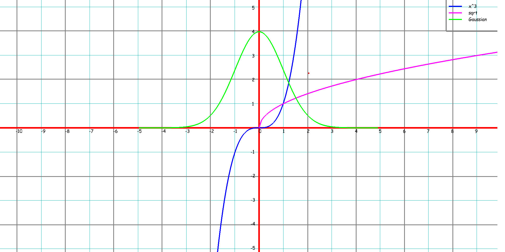
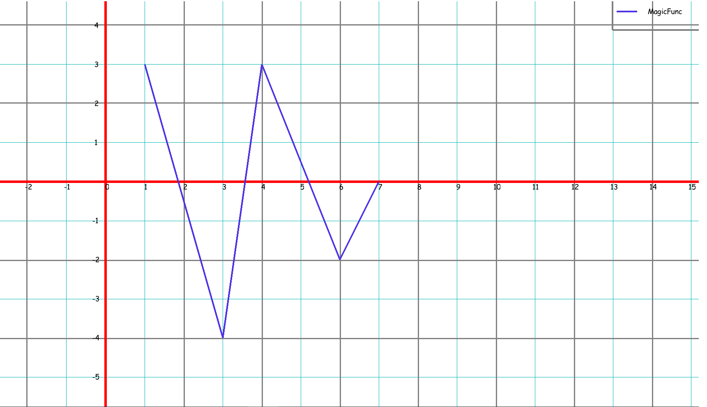
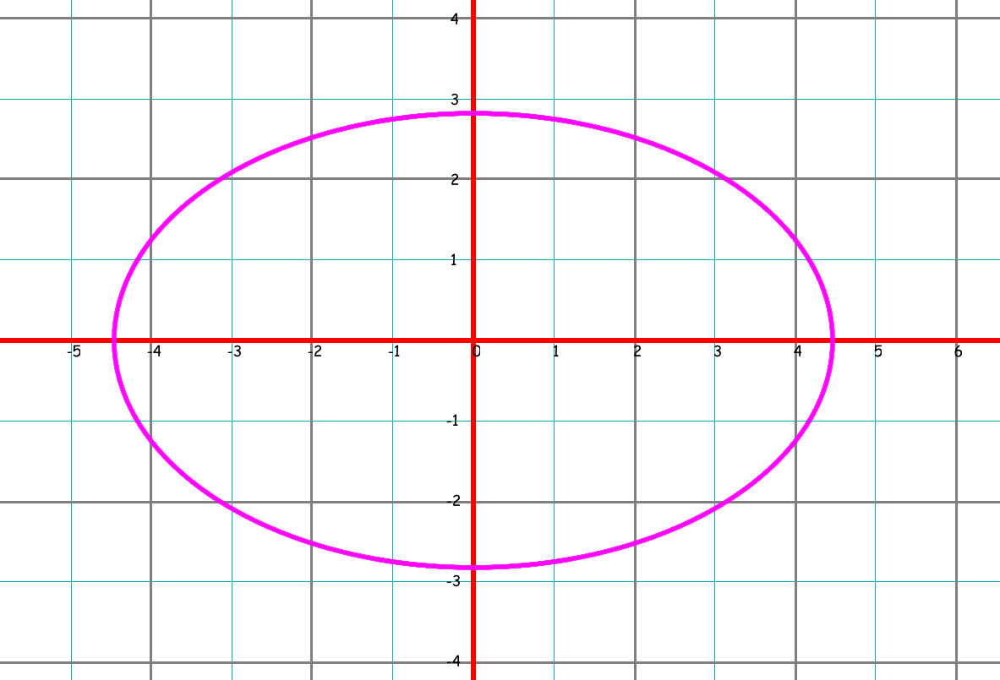
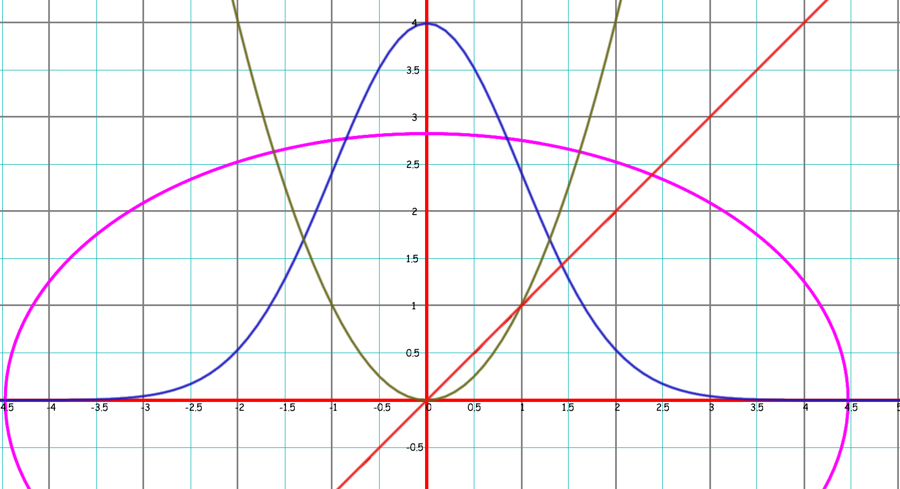
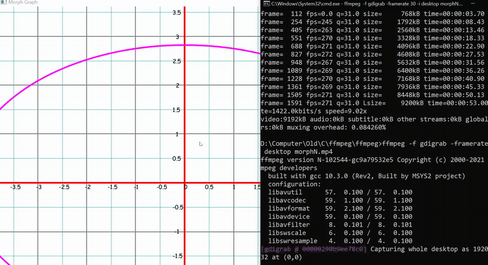

# Morph
A simple graph plotter API that is readily callable from C and is easy to interface with other languages.

A simple graph plotter that can plot real valued function (discontinuous plotting is restricted to one function for now). <br><br>
Morph stands for Morphism in a sense that graph plotting is basically mapping points obtained from function to screen pixels:D.  <br>

# Build 
open(``Morph.sln``).then(``Ctrl+F5``)

## Linux Build 
Just provide required glfw's *.c files to cc and some -I\* and -L\* things and it compiles. If not clear, wait for build.sh or cmakelists.txt file. 

# Demo -> Func Plot
```c
#define _CRT_SECURE_NO_WARNINGS

#include "./Morph.h"
#include <math.h>

double xcube(double x)
{
    return x * x * x;
}

int main()
{
    MorphPlotDevice device = MorphCreateDevice();
    // Add Gaussian * 4 func here 
    MorphPlotFunc(&device, xcube, 0.0f, 0.0f, 1.0f,-10.0f,10.0f, "x^3",0.0f);
    MorphPlotFunc(&device, sqrt, 1.0f, 0.0f, 1.0f,0.0f,200.0f, "sqrt",0.1f);
    MorphShow(&device);
    return 0;
}
```

# Output 
<p align="left">
  

# Demo -> List Plot 

 ```c
#include "./Morph.h"

int main()
{
    MorphPlotDevice device = MorphCreateDevice();
    
    float x[] = {1, 3, 4, 6, 7};
    float y[] = {3, -4, 3, -2, 0};
    MorphPlotList(&device, x, y, 5, 0.3f, 0.2f, 0.9f, "MagicFunc");
   
    MorphShow(&device);
    return 0;
}
```

# Output 
<p align="left">
    

## Implicit functions 

<p align = "left"> 
     
</p> 

<p align = "left"> 
     
</p> 

## Interactive Demo 
<p align = "center">
    

